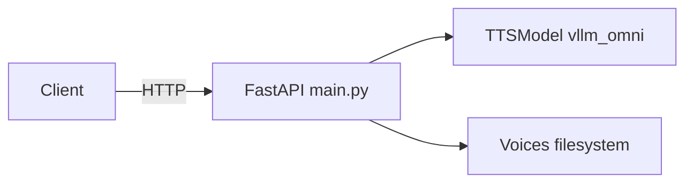

# Architecture

## Components

- **FastAPI** (`app/main.py`): HTTP layer, validates JSON bodies, serves WAV responses for speech generation, lists voices from disk.
- **TTSModel** (`app/model.py`): Lazy-loads `OmniModel.from_pretrained` and calls `generate(input=..., voice=..., response_format=...)`.
- **Voices**: Default voice samples are expected under `{VOICES_DIR}/default/` as `.wav` files. The list endpoint only includes filenames ending in `.wav`.

## Logging

- Application uses **loguru** with a rotating file `tts_server.log` (see `app/main.py`).
- Standard `logging` is also configured at INFO for libraries.

## API surface

See [api.md](api.md). Interactive schema: when the server is running, OpenAPI is available at `/docs` and `/openapi.json` (FastAPI default).
